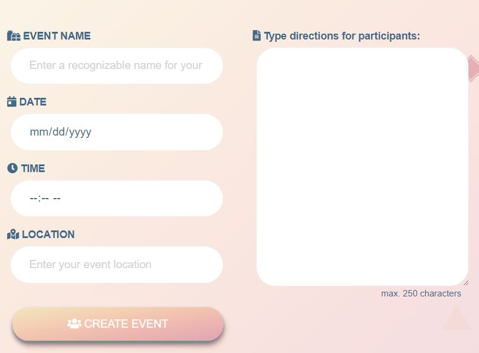

# Sum

### What is this repo?

* This app is a gifting fix for groups, to avoid buying duplicate presents and having to ask each person what has already been purchased.

### How does it work?

* Users login to the app using Passport validation.

* Users must either join an Event group using a unique code 

or create a new group and recieve a unique code.

* The app then displays the other users in the Event group and the list of gifts they have input.

* Users have the funtionality to update their own gift request lists (which adds them in database using POST method), they also have the   functionality to mark other users gifts they will buy (which will update the database with PUT method).

* Table joins in SQL are used with POST methods to send different information from objects.

### Who will use it?

* The app is designed for event gifting, people who have many people to buy for and want to see who they have purchased gifts for, and what they still need to buy consolidated in one easy location. 

* It is also useful for events where members do not know eachother well and will not communicate the gifts they buy beforehand.

* This code is for a group project but anyone is welcome to look at or explore the code.
